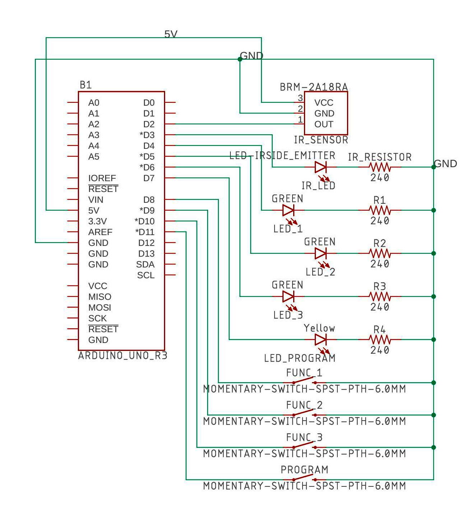

## IR translator
## Opis projektu
Zaprojektowanie i wykonanie urządzenia z wykorzystaniem Arduino pozwalającego sterować jednym pilotem IR dwoma urządzeniami. Po wykryciu sygnału IR, urządzenie sprawdza czy jest on zapisany w pamięci jako sygnał wyzwalający. Jeśli tak, to urządzenie wysyła przypisany do danego sygnału inny sygnał IR. Przykład: sterowanie grzejnikiem za pomocą pilota do TV: przyciski głośności +/- zmieniają temperaturę, przycisk ON/OFF włącza/wyłącza. 

